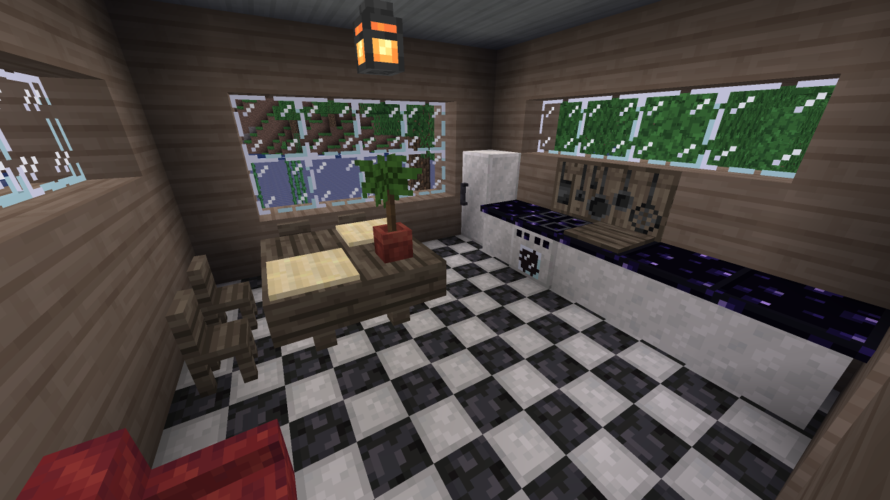

# VoxeLibre Furniture and decorations mod [mcl_decor]
Adds more decoration and furniture blocks to VoxeLibre (ex. MineClone2) and Mineclonia

## About

This mod adds various blocks into the game that you can use to furnish and decorate your house, office or whatever you're building in VoxeLibre!

Added blocks are:

* Armchairs
* Chairs
* Tables
* Dyed Planks
* Paths
* Hedges
* Curtains
* Doorbells
* Checkerboard Tile
* Table Lamp
* Oven
* Counter
* Fridge
* **and more are planned!**

Want to read more? [Check out the Wiki!](https://codeberg.org/rudzik8/mcl_decor/wiki)

## Contributing (how you can help)

### Translate the mod
Fork this repo, copy "template.txt" and paste it as "mcl_decor.XX.tr", where XX is your 2-letter language code (for example, "de" for German/<ins>De</ins>utsch). Then you can open that file and translate strings into the language of choice.
Once the translation is done you need to create a pull request, and if it has no problems - I'll gladly merge it into the mod!

### Report bugs
Yes! In the "Issues" tab in this repo. If you find anything in my mod that might be a bug (or something unintended) - report it.

### Suggest new blocks
Do you think this mod doesn't add enough blocks? Feel free to post suggestions! It's also done in the "Issues" tab.

### Share this mod with friends and make reviews
On ContentDB of course (but I don't mind some blog posts, you know). Reviews motivate me to continue updating this mod. Also, you can star this repo on Codeberg as well!

### Help me with coding
While I'm already quite experienced with modding for Minetest/VoxeLibre in Lua, there's certainly some things I'm struggling to implement or fix. Check the issues, pick something you know you can do, fork and make a pull request!

**Thanks.** Those who contribute to the mod get my eternal respect. And a cookie. ;D

## License

The code is licensed under GPLv3-or-later, see the LICENSE file for details.

The media is licensed under CC BY-SA 4.0, see [this deed](https://creativecommons.org/licenses/by-sa/4.0/) for details (contains a link to the full version).

## Credits

**For the media:**

- [Checkerboard Tile texture](textures/mcl_decor_coalquartz_tile.png) uses the [coal block](https://git.minetest.land/VoxeLibre/VoxeLibre/src/branch/master/textures/default_coal_block.png) and [side quartz block](https://git.minetest.land/VoxeLibre/VoxeLibre/src/branch/master/mods/ITEMS/mcl_nether/textures/mcl_nether_quartz_block_side.png) textures under [CC BY-SA 4.0](https://creativecommons.org/licenses/by-sa/4.0/) by [XSSheep](https://github.com/XSSheep) (combined)
- [Dyed planks template texture](textures/mcl_decor_dyed_planks.png) uses the [oak planks](https://git.minetest.land/VoxeLibre/VoxeLibre/src/branch/master/textures/default_wood.png) texture under [CC BY-SA 4.0](https://creativecommons.org/licenses/by-sa/4.0/) by [XSSheep](https://github.com/XSSheep) (desaturated and lighted up a bit from original)
- [Table Lamp texture](textures/mcl_decor_table_lamp.png) (both on and [off](textures/mcl_decor_table_lamp_off.png)) uses the [red wool](https://git.minetest.land/VoxeLibre/VoxeLibre/src/branch/master/textures/wool_red.png), [black wool](https://git.minetest.land/VoxeLibre/VoxeLibre/src/branch/master/mods/ITEMS/mcl_wool/textures/wool_black.png), [torch](https://git.minetest.land/VoxeLibre/VoxeLibre/src/branch/master/mods/ITEMS/mcl_torches/textures/default_torch_on_floor.png), [smooth stone](https://git.minetest.land/VoxeLibre/VoxeLibre/src/branch/master/mods/ITEMS/mcl_stairs/textures/mcl_stairs_stone_slab_top.png) and [oak tree](https://git.minetest.land/VoxeLibre/VoxeLibre/src/branch/master/mods/ITEMS/mcl_core/textures/default_tree.png) textures under [CC BY-SA 4.0](https://creativecommons.org/licenses/by-sa/4.0/) by [XSSheep](https://github.com/XSSheep) (combined and resized)
- [Curtains overlay texture](textures/mcl_decor_curtain_overlay.png) uses the [top iron pane](https://git.minetest.land/VoxeLibre/VoxeLibre/src/branch/master/textures/xpanes_top_iron.png) texture under [CC BY-SA 4.0](https://creativecommons.org/licenses/by-sa/4.0/) by [XSSheep](https://github.com/XSSheep) (resized)
- [Oven front texture](textures/mcl_decor_oven_front.png) uses the [top quartz block](https://git.minetest.land/VoxeLibre/VoxeLibre/src/branch/master/textures/mcl_nether_quartz_block_top.png), [obsidian](https://git.minetest.land/VoxeLibre/VoxeLibre/src/branch/master/textures/default_obsidian.png) and [glass](https://git.minetest.land/VoxeLibre/VoxeLibre/src/branch/master/textures/default_glass.png) textures under [CC BY-SA 4.0](https://creativecommons.org/licenses/by-sa/4.0/) by [XSSheep](https://github.com/XSSheep) (combined and resized)
- [Oven front active texture](textures/mcl_decor_oven_front_active.png) uses the [top quartz block](https://git.minetest.land/VoxeLibre/VoxeLibre/src/branch/master/textures/mcl_nether_quartz_block_top.png), [obsidian](https://git.minetest.land/VoxeLibre/VoxeLibre/src/branch/master/textures/default_obsidian.png) and [glass](https://git.minetest.land/VoxeLibre/VoxeLibre/src/branch/master/textures/default_glass.png) textures under [CC BY-SA 4.0](https://creativecommons.org/licenses/by-sa/4.0/) by [XSSheep](https://github.com/XSSheep) (combined and resized)
- [Oven side texture](textures/mcl_decor_oven_side.png) uses the [top quartz block](https://git.minetest.land/VoxeLibre/VoxeLibre/src/branch/master/textures/mcl_nether_quartz_block_top.png) and [obsidian](https://git.minetest.land/VoxeLibre/VoxeLibre/src/branch/master/textures/default_obsidian.png) textures under [CC BY-SA 4.0](https://creativecommons.org/licenses/by-sa/4.0/) by [XSSheep](https://github.com/XSSheep) (combined and resized)
- [Oven top texture](textures/mcl_decor_oven_top.png) uses the [obsidian](https://git.minetest.land/VoxeLibre/VoxeLibre/src/branch/master/textures/default_obsidian.png) texture under [CC BY-SA 4.0](https://creativecommons.org/licenses/by-sa/4.0/) by [XSSheep](https://github.com/XSSheep) (slightly modified)
- [Fridge texture](textures/mcl_decor_fridge.png) uses the [top quartz block](https://git.minetest.land/VoxeLibre/VoxeLibre/src/branch/master/textures/mcl_nether_quartz_block_top.png), [polished blackstone](https://git.minetest.land/VoxeLibre/VoxeLibre/src/branch/master/textures/mcl_blackstone_polished.png) and [smooth basalt](https://git.minetest.land/VoxeLibre/VoxeLibre/src/branch/master/textures/mcl_blackstone_basalt_smooth.png) textures under [CC BY-SA 4.0](https://creativecommons.org/licenses/by-sa/4.0/) by [XSSheep](https://github.com/XSSheep) (combined and resized)
- [Curtains sound](sounds/mcl_decor_curtain.ogg) uses the [Curtains.wav](https://freesound.org/people/Mr_Alden/sounds/365700/) sound under [CC BY-NC 4.0](https://creativecommons.org/licenses/by-nc/4.0/) by [Mr_Alden](https://freesound.org/people/Mr_Alden/) (cropped and compressed)
- [Fridge opening](sounds/mcl_decor_fridge_open.ogg) and [fridge closing sound](sounds/mcl_decor_fridge_close.ogg) use the [Fridge 01](https://freesound.org/people/CaKon/sounds/522148/) sound under [CC BY 4.0](https://creativecommons.org/licenses/by/4.0/) by [CaKon](https://freesound.org/people/CaKon/) (cropped and compressed)

**For the code:**

- Sitting function (in `api.lua`) uses code from [ts_furniture mod](https://content.minetest.net/packages/Thomas-S/ts_furniture/) under [MIT](https://spdx.org/licenses/MIT.html) by [Thomas-S](https://content.minetest.net/users/Thomas-S/)
- Oven code (`oven.lua`) uses code from [mcl_smoker](https://git.minetest.land/VoxeLibre/VoxeLibre/src/branch/master/mods/ITEMS/mcl_smoker) under [LGPLv2.1](https://www.gnu.org/licenses/old-licenses/lgpl-2.1-standalone.html) by [Wuzzy](https://wuzzy.codeberg.page/) and PrairieWind
- Doorbell code (`doorbell.lua`) uses code from [mesecons_button](https://git.minetest.land/VoxeLibre/VoxeLibre/src/branch/master/mods/ITEMS/REDSTONE/mesecons_button) and [mesecons_noteblock](https://git.minetest.land/VoxeLibre/VoxeLibre/src/branch/master/mods/ITEMS/REDSTONE/mesecons_noteblock) under [LGPLv3-or-later](https://www.gnu.org/licenses/lgpl-3.0-standalone.html) by [Jeija](https://jeija.net/) and contributors for both the original Mesecons mod and the MineClone2 fork
- Fridge code (`fridge.lua`) uses code from [mcl_barrels](https://git.minetest.land/VoxeLibre/VoxeLibre/src/branch/master/mods/ITEMS/mcl_barrels) under [LGPLv2.1](https://www.gnu.org/licenses/old-licenses/lgpl-2.1-standalone.html) by [AFCMS](https://afcms.github.io/) and contributors

**Miscellanous:**

- [Homedecor modpack](https://content.minetest.net/packages/VanessaE/homedecor_modpack/) and [xdecor](https://content.minetest.net/packages/jp/xdecor) mods were inspiration for me partly. Thanks to [VanessaE](https://content.minetest.net/users/VanessaE/) and [jp](https://content.minetest.net/users/jp/) for them!
